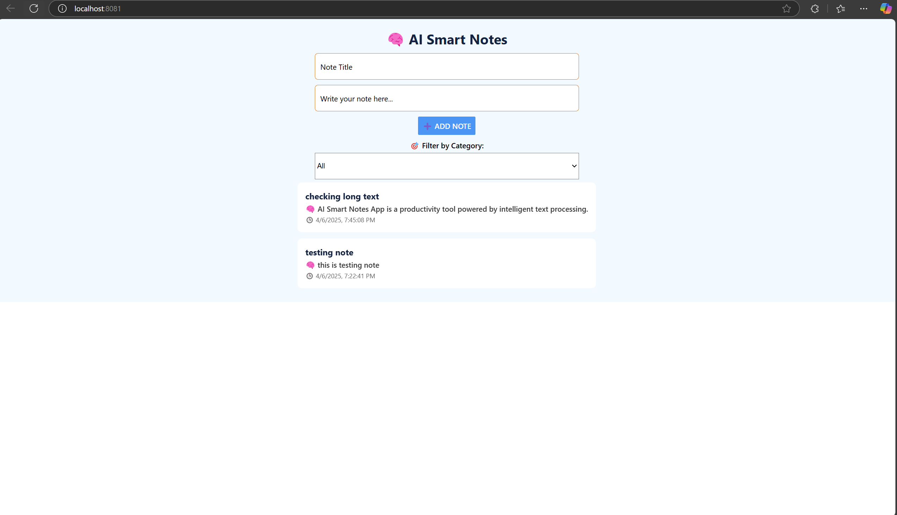
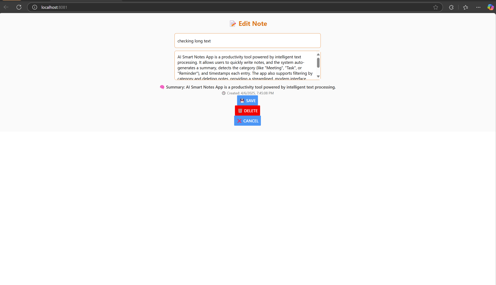

# 🧠 AI Smart Notes App

A cross-platform, AI-enhanced smart note-taking app built using **React Native**, **Node.js**, and **MongoDB**. This app enables users to write notes with a title and content, automatically generates summaries, categorizes them (e.g., Meeting, Task, Reminder), and supports full CRUD operations with filtering and timestamps. The UI is fully mobile-friendly and optimized for productivity.

---

## ✨ Features

- ✅ Add notes with a **title** and **detailed content**
- 🧠 Auto-generates **summary** using built-in logic (OpenAI optional)
- 🏷️ Auto-categorizes notes based on content keywords
- 🗓️ Displays human-readable **timestamps**
- 🎯 Filter notes by category (Meeting, Task, etc.)
- 📝 View, **edit**, or **delete** notes using a modal popup
- 📱 Clean and modern UI with **React Native + Expo**
- 🧠 Easy-to-enable **OpenAI GPT** summarization support

---

## 📱 Screenshots

_Add screenshots to show the UI. Example layout below:_

### ➕ Add Note Page



### 📝 Modal Edit View



---

## 🛠️ Tech Stack

| Part       | Technology         |
|------------|--------------------|
| Frontend   | React Native (Expo) |
| Backend    | Node.js + Express   |
| Database   | MongoDB + Mongoose  |
| Optional AI| OpenAI GPT-3.5      |

---

## 🚀 Getting Started

### 🔧 Backend Setup

```bash
cd backend
npm install
# Create a .env file with your MongoDB URI:
# MONGO_URI=mongodb+srv://<username>:<password>@cluster.mongodb.net/yourDB
node server.js
```

---

### 📲 Frontend Setup (React Native + Expo)

```bash
cd frontend/ai-smartnotes-app
npm install
npx expo start
```

> Use **Expo Go** app to scan the QR and run on your mobile.

---

## 🧠 Enable OpenAI Summarization (Optional)

1. Go to https://platform.openai.com/ and create an API Key.
2. Add this line in your `.env` file:
```
OPENAI_API_KEY=sk-xxxxx
```
3. Uncomment the `OpenAI` section in `server.js`.

---

## 🧑‍💻 Author

**Nihitha**  
- GitHub: [@sw-developer167](https://github.com/sw-developer167)  

---

> 💬 Feel free to fork, contribute, or reach out for collaboration!

